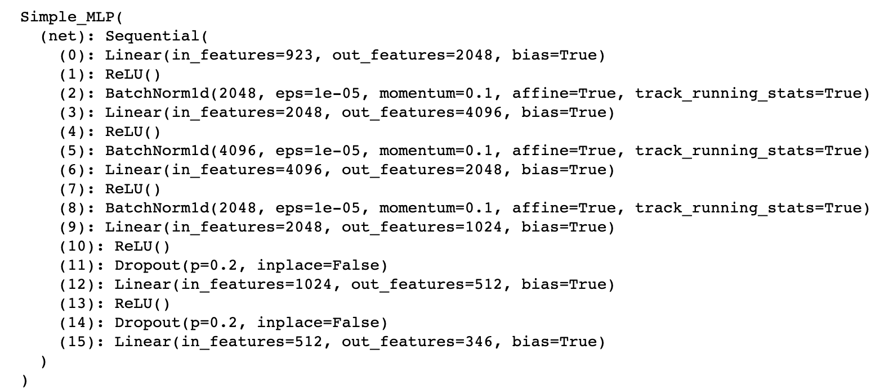

## File Introduction 
1. There are two parts in hw1, part1 is about developing my own version of the popular deep learning library PyTorch. It will (cleverly) be called “MyTorch”. A key part of MyTorch will be implementation of Autograd, which is a library for Automatic Differentiation.

2. Part 2 is a MLP model using PyTorch for speech classification. 
## Part 2 Model architecture and hyper-parameters:

Established a Multilayer Perceptron model using PyTorch for speech classification. 
hyper-parameters, criterion, optimizer:

batch_size = 1024

context = 35

criterion = nn.CrossEntropyLoss()

optimizer = optim.Adam(model.parameters(), lr=0.001, weight_decay=1e-4)

## Tricks to enhance model performance:
1. By changing the baseline deeper and wider for enhancing the prediction accuracy on test data.

2. Optimized model by adding a scheduler to decreasing learning rate over time.

3. Adding Batchnorm 1d and Droupout.

4. Use larger context.

5. Achieved a 30% increase in accuracy compared to baseline.

#### hw1_p2 PDF file has more information about dl tasks.

